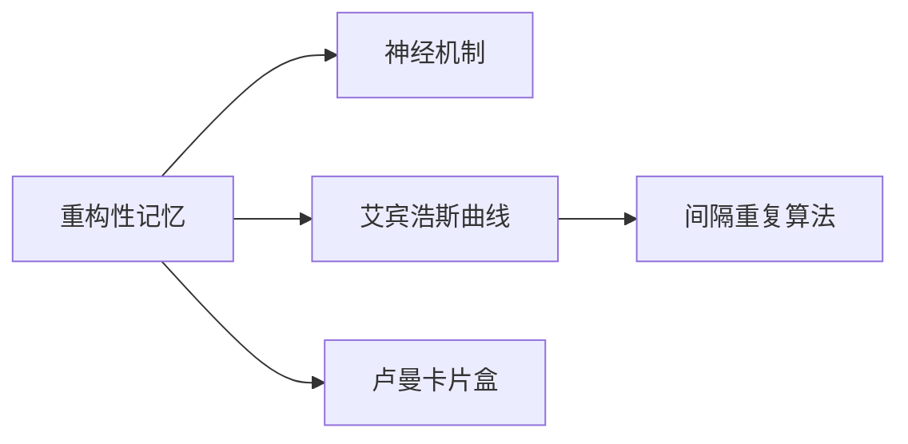

### 反思&&汇总
  - 这个社会是真的病了，嫌贫爱富，爱慕虚荣，欺瞒狡诈，见利忘义。
  - 而且这种病还在传染，还在扩散，希望是有的，但不多。
  - 不管外界如何变幻，守住本心才是根本。
  - 在这个吃人的地狱里，即使没有人和我同行，我也会独自一人走到最后，我要看看这个吃人的魔鬼长什么样子。
  - 不要被人坑，也不要坑人，坚守本心，大道可成。
---
### 凡人修仙传
  - 韩立有个好师父，亲传亲授韩立同学——江湖险恶，人心叵测！
---
### 原神
  - 最近玩原神，感受颇多，提瓦特大陆虽美，但怪也凶残，对待怪就不能手软，得下硬手，平时的锻炼也是必不可少的，这和生活中的修行是一样的，武艺不佳，遇到打不动得怪就得抓瞎。当然了，可以请外援，但是外援若是实力不济，或者袖手旁观，那就只能腹背受敌了。
---
### 突破封锁
  - 小时候经常锄地，得空的时候总要去看动画片，全然没有主动学习的意识。当时若把时间合理得分配一下，学习的压力也不会陡然来袭。岁月不能回转，时光只能向前，唯有总结经验教训，才能吃一堑长一智。世界发展出奇的快，紧赶慢赶还是拉了一大截，互联网时代开启了所有人的智慧，所思所想，所感所悟，网上都可以找到借鉴，知识的获取变得异常便捷，但也要看到人类早就把自己局限在了认知范围内，大数据推荐更是创造了信息茧房，人类虽然获取知识的途径变多了，但也被固有得经验所诅咒，无法突破信息封锁。
---
### 灵感
  - 灵感是一种一瞬即逝的想法，及时的记录灵感，才能跟随自己的内心，倾听内心世界的独白，需要在安静的环境中，心无杂物的倾听、记录内心里的那个声音。这种转瞬即逝的想法真的很奇妙，不用多想，只需记录内心的声音。就像原神，旅行者跟着派蒙的指引就可在提瓦特横走一样。但是这种内心的声音，很容易受到外界的干扰，进而变得碎片化，很难被捕捉，就拿刷抖音这件事来说，一条和一条截然不同的内容，会导致思绪的不断切换，表面上感到很愉悦，但是平静过后依旧是空虚的。
---
### 欺骗大脑
  - 大脑是一种惰性存在，启动慢，易受外界干扰而改变目标方向。所以适时的欺骗大脑变得很有必要。—— 我只学十分钟，结果愣是学了两小时。
  - 每次都告诉大脑:
    - 只玩两分钟
    - 只睡五分钟
    - 只刷十分钟
  - 大脑太单纯，复杂的是人。
  - 8点起床，背5个单词，一看时间，12点了。
---
### 思维提升
  - 话语权的争夺，本质上意味着思维的提升。一味的被打压，丢失话语权，进而形成被压制的思维。思维无法提升，降维打击也就无从谈起。思维提升的关键在于从更高维度汲取能量，从更广度获取知识并加以提炼，进而编制构成网格化，再在实践中巩固所学所思。进而改变现阶段的惯性思维模式。
---
### 雁回时
  - 小病医体，大病医心。
  - 天作丝丝道难行，含泪挥手送君行。 雨路人离 —— 露禽
  - 寒潭倒映天水一色，雁北飞去不起涟漪。(寒潭倒映天水一色，雁北飛去不起漣漪)
  - 云烟渺渺孤舟只影, 夕晖漫天青丝何寄。(雲烟渺渺孤舟隻影，夕暉漫天青絲何寄)
---
### 决策
  - 任何情绪化的思绪，感性化的认知都会导致后续行动的受挫。
  - 沉没成本不参与决策。
  - 如果感觉某人不靠谱，要出问题，就千万要做好风险管理，不然将陷自己于悬空之地，因为某人的承诺只是他的认知，其中的种种情况，很难预料，各种风险叠加在一起，是个人所不能承担的。所以还是要相信感觉，相信直觉。如果一件事开始的时候就显得不靠谱，那么后续就很难靠谱起来。
---
### 复杂任务拆分
  - 复杂任务拆分成若干的小任务，小任务再拆分成小目标，小目标再一个个突破实现，最后再汇总复盘。多线程处理小目标，要注意协调小任务之间的关系，把握总体布局。避免偏离总目标。
---
### 思绪平衡
  - 避免系统输入过多的负面信息。如果一个人输入过量的负面信息，他的内心是很难消化的。过量的负面消息，导致悲观情绪的建立，而悲观情绪的建立又进一步加深负面信息的摄取，最终会深陷其中不能自拔。正所谓：小病医体，大病医心。
  - 静下心来多和以前的自己对话，倾听以前的总结教训,指导未来迷失的自己。
  - 多行动，多做事，少发表意见。多做改变未来的行动，纠正迷失的自己。在生活中，烦心的事是一件接一件，如果不能及时消除这些不利的心绪，是很难保持一颗宁静思考的心，切记做烂好人！东郭先生与狼的故事生活中还在不断上演。
---
### Code
``` code
termux
termux-ubuntu
code-server
apt upgrade //安装更新
wget https://github.com/cdr/code-server/releases/download/2.1698/code-server2.1698-vsc1.41.1-linux-arm64.tar.gz
tar -xvf code-server2.1698-vsc1.41.1-linux-arm64.tar.gz  //解压
```

---
### 时间&杂感
  - 关于时间和金钱关系的论述，有很多。譬如：一寸光阴一寸金，寸金难买寸光阴。莫等闲，白了少年头，空悲切。对于一个人最重要的也是时间，如果一个人可以看到自己的终点，或许更能清楚地明白时间的宝贵了。可是我们毕竟看不到未来，但是我们可以看到自己的过去，通过探寻过去的轨迹，进而发现更适合的未来。坚持正确的，摒弃错误的，去伪存真。一遍遍的洗涤自己的灵魂，才能更加通透的面对未来。因为过去的轨迹是惯性的，这种惯性或许是某种习惯，又或者是生活中两点一线所带来的灵魂的麻痹。时间久了，也会丧失往日的斗志，变得浑浑噩噩，随波逐流。就像大多数人的生活一样，日复一日，过着简单重复单调的生活，麻痹在追剧，抖音，新闻，时政里，于个人思想境界的提升没有一点用处。当然了，生活的苦难压得人喘不过气，我们适当的麻痹一下也是可以的，但若沉沦其中，就很难进步了。某些人就天天想进部，思想也太先进了。关于放羊有一则故事，看抖音，追剧，看新闻，时政，就如同看别人放羊，别人获得了流量，推广了观点，别人的羊是一天比一天肥，而自己的生活却是一天比一天糟糕。现今的社会是一个前所未有的大变革的信息社会。信息爆炸式的增长、更新。每个人都必须时刻接受新的知识，如被经验和固有的知识所禁锢，很快就会被落下。
  - 时间和复利是商人牟利的手段，就像"提瓦特奸商旅行者和派蒙"一样，便宜的药剂我不去卖，专门上架价格贵的，专坑提瓦特普通民众。哈哈 。对于我们一般人而言，也要学会利用这种规则，好的装备可以提升生产力，好的技术可以更新知识结构，生产力和知识结构更加能形成一种正向循环。关于看到以前想买macbook的后续总结： 想买趁手的兵器，奈何手里没有多余的摩拉，哎，真是处处受限的一天。
---
### 纪录片
  - 无节制消费的元凶
  - 但是还有书籍
  - 万物与虚无
  - 抽象:设计的艺术
  - 积极心理学
  - 粒子狂热
  - 维度:数学漫步
  - 公司的力量
  - 混沌之谜
  - 人生果实
---
### Bilibili大学课程
  - 来自星星的何教授 物理科普
  - 乔伯伯英语 记英语
  - 王德峰 哲学
  - 不刷题的吴姥姥 物理学
  - 传播学刘阳 传播学
  - 林少华林老师 文学
  - 董晨宇RUC 传播学
  - 张良仁教授 考古学
  - 韩潇老师讲诗词 文学
  - 张志浩在剥柚 历史
  - 框框老师课堂 数学
---
### 内心的虚无
  - 如何克服平凡生活中的内心的虚无，或者说是长时间的缺乏安全感。
  - 陷入债务危机后，如何摆脱现状，
  - 当务之急是整理思绪，再重整出发，
  - 以运维，拆解，售后为突破口，
  - 加强知识的总结和归纳。
  - 平静内心，平静内心。
  - 看清楚一些人，一些事，做好自己，管理好自己的情绪，莫管闲事。
---
### 抄书学习与音乐同步进行
  - 心情烦闷之际可以听一些舒缓的音乐，与此同时可以抄写一些可用的东西，转移一下注意力。
  - 最近玩原神，也发现了很多值得玩味的心理学方面的问题，游戏的设计也蕴藏了很多心理学方面的问题，其中就是如何吸引玩家把游戏进行下去。每日的任务奖励或许只是第一步，把玩家先拉进来，最近又在游戏里面引入了做饭，撸猫，虚拟经商，等方面的白给原石计划，就是进一步的提升玩家的体验。游戏的可玩性也就大大增加了。
  - 我们在办一些比较难的事情的时候，如果开始的难度太大，会导致直接失去了前进的动力，也会直接产生排斥心理，如何克服，也就是困难的划分很关键，这个划分要有一定的奖励机制，这也是很多游戏都会有的。故此，我们的生活中也可以引入其中。
  - 大脑是喜欢安逸的环境，如果环境气氛过于压抑，大脑的动力也就很难调动出来，在写总结和思考的时候，适当的舒缓的音乐可以缓解这种压抑感，大脑的积极性也会被调用出来，当然平日里要注意收藏一些舒缓的音乐，不同类型的音乐对于环境气氛的塑造是不同的，也会影响人的心情。根据心境去切换音乐显得很重要，音乐疗法，简称或许也是心情平复的关键吧。
---
### 深海环境music
  - 暗恋是隐线
  - ivu是明码呼叫
---
### 没事多出去转转，别老宅在家里
  - 今晚故地重游,南郊那边拆迁完后就再没去过，今晚烦闷就骑车出去逛了逛，很久没出去看了，一切都在变。
---
### 当你凝视深渊的时候，深渊也在凝视你
  - 当你凝视深渊的时候，深渊也在凝视你，尤其在这个互联网大数据，个人喜好算法的时代。过度的关注负面信息，会使生活中到处都充斥着负面信息，而这对于一个人正确的认识这个世界是极为不利的。及时的从负面信息中抽离出来，回归正轨的生活，才是最应该做的事情。
  - 过往的总结在怎么精确，如果不能保持清醒的头脑，就会被一时迷惑，做出错误的决策，每次的重大决策，必须三四而后行。
  - 人的忘性是很大的，随着时间的推移，我们很难记住一些事情，及时的做备注，做笔记，可以帮助我们再现已经忘记的事情。
---
### 修行
  - 方寸海纳，意动神随。
  - [见生符](https://zhuanlan.zhihu.com/p/624690206)
---
### 原神
1. [米游社·原神](https://www.miyoushe.com/ys/article/20160159)
  - 你要与我为敌吗？决心，勇气，爱慕，仇恨都会在时间长河中变质扭曲，一切都是为了对抗磨损，我是你的过去，我是万事不变的法则，我是永恒的守护者。 —— 雷电将军
  - 总会有地上的生灵敢于直面雷霆的威光。—— 枫原万叶
---
### 祛魅
1. 金玉其外，败絮其中。对于任何人都要祛魅。都披着一张人皮，但你不知道人皮底下到底是人还是鬼？
1. [沪上说金](https://v.douyin.com/uEyB3TFdL3s/)
---
### 重构性记忆
  - **重构性记忆**现象——遗忘并非彻底消失，而是记忆痕迹在神经回路中休眠，当重新接触相关信息时，大脑会基于原有神经痕迹进行**模式激活与信息重组**。这种机制体现了记忆的动态性和可塑性，我们可以从四个维度深入理解其本质：

     * **神经科学机制：记忆痕迹的再激活**
       - **记忆存储的分布式本质**
记忆并非静态"文件"，而是以**神经连接模式**分散存储于大脑多个区域。例如语义记忆存储于颞叶，情境记忆依赖海马体与皮层协作 。当你复习时，大脑并非从零重建知识，而是重新激活原有神经回路，并加入新的上下文信息。

        - **脑电波的方向性重构**
神经科学研究发现：记忆存储时脑电波从后向前传播，而提取时则反向从前向后传播。这种**双向传播机制**使得复习成为原有记忆痕迹与新认知的混合过程，形成"熟悉的陌生感"——既非全新，亦非原貌。

      * 心理学视角：记忆的三重重构特性
        * **信息筛选式重组**
每次回忆都是大脑根据当前需求对原始信息的**选择性重构**。例如复习专业概念时，大脑会自动强化核心原理（如"遗忘曲线"），弱化细节（如艾宾浩斯实验的具体日期）。

        * **认知框架的持续性**
即使具体内容遗忘，初次学习时建立的**认知框架**（如知识分类逻辑、问题解决路径）会持久保留。例如：
          - 学习数学证明后忘记步骤，但保留"从条件逆向推导"的思维模式
          - 阅读文献后忘记论点，却记住"比较研究法"的分析框架

        * **情感印记的强化效应**
伴随强烈情感体验（如突破难题的喜悦）的记忆会形成更深的**情绪印记**。复习时相关情感被重新激活，加速知识重构效率。
---
  - **高效学习启示：重构规律的应用策略**
    - 基于此规律，可设计科学复习方案：

   | **策略**| **原理**| **实践工具**|
   |------------------|------------------------------|   ------------------------------|
| **间隔提取练习** | 利用记忆去稳定化   （destabilization）机制 | Anki记忆卡/Quizlet|
| **框架优先复习** | 激活认知框架引导细节重构| 思维导   图中心主题先行|
| **情景模拟**| 重建初始学习时的神经激活模式| 回归原   始学习环境/姿势|
   | **教授他人**| 强迫大脑进行深度模式重组| 费曼技巧|
---
  - **知识管理实践：重构能力的系统化增强**
1. **双链笔记系统**
使用Obsidian等工具建立**概念网络**，即使遗忘细节，通过核心节点（如"重构性记忆"）可快速重建知识关联 ：


2. **渐进式知识封装**
借鉴卢曼卡片盒法的**信息原子化**原则 ：
- 初级笔记：碎片化记录原始灵感
- 永久笔记：整合多个碎片形成概念单元
- 主题笔记：封装概念单元为知识模块
即使模块细节遗忘，其封装边界仍指引重构方向。

---

这种记忆重构机制揭示了一个深刻认知原理：**知识的价值不仅在于存储密度，更在于神经连接的灵活性**。当你感到"似曾相识却表述不清"时，恰是大脑在调用残留的神经模式进行创造性重组——这正是人类区别于人工智能的核心学习优势。善用此特质，可突破机械记忆的局限，实现知识的有机生长。

---
### 觉悟
> **灵性高的人，你的道路注定与众不同。这个世界为大多数人铺设了一条既定的轨道——上学、工作、结婚、买房、退休...., 但灵性高的你，注定无法完全遵循这样的剧本。你的灵魂选择了另一条路：不是追求世俗的成功，而是活出内在的觉醒。**
  - **勿要随波逐流**
    - 你无法"随波逐流"，因为你的感知太敏锐。
    - 普通人轻松融入社会的喧嚣，但你不行，你常常显得格格不入。但这不是缺陷，而是天赋——你能看见别人看不见的真实。
  - **把控自己的节奏**
    - 你的成长节奏，和世界不同步。
    - 社会推崇"30岁前成功""40岁前财务自由"，但你的人生轨迹可能完全不同：
      * 20-30岁：你可能在迷茫中探索，比同龄人"慢半拍"；
      * 30-40岁：当别人开始中年焦虑，你反而进入觉醒期；
      * 40岁后：你的灵性智慧真正绽放，活出超越年龄的轻盈与通透。
  - **独自经历暗**夜
    - 你注定要经历"灵魂的暗夜"。
    - 普通人的人生是平缓的曲线，而你可能会经历剧烈的起伏：
    - 某段时间，你可能突然对一切失去兴趣，甚至陷入存在主义危机；
    - 某些关系会以痛苦的方式破裂，只为让你学会更深层的爱；
    - 某些"失败"，其实是宇宙在帮你避开错误的道路。
    - 这些黑暗时刻不是惩罚，而是灵魂的淬炼，为了让你更接近真实的自己。
  - **独处、冥想、素食**
    - 你很难找到"同类"，但终将遇见灵魂家族。
    - 你的话题（灵性、宇宙、能量）别人不感兴趣；
    - 你的生活方式（独处、冥想、素食）显得另类；
    - 你的价值观（真实、利益、自由、稳定）不被理解。
  - 但请相信，你并不是异类，只是尚未遇见能与你共振的人。随着你的频率提升，真正的灵魂家族会自然出现——可能是某个突然深聊的朋友，也可能是跨越时空的精  神导师。
  - **定义自己的成功**
    - 你的"成功"，不是世俗定义的。
    - 社会告诉你：成功=财富+地位+影响力。
    - 但你的灵魂知道：成功=觉醒+自由+能量纯净。
    - 你或许不会成为富豪，但你能在简单生活中感受到丰盛；
    - 你或许没有世俗权力，但你的存在能无声地影响他人；
    - 你或许不被大众熟知，但在更高的维度，你的光已被看见。
  - **创建自己的道**
    - 信任直觉——你的内在导航比任何外界建议都准确。
    - 允许不同步——不必追赶别人的节奏，你有自己的时区。
    - 保护能量——远离消耗你的人和事，守护你的灵性火焰。
    - 享受孤独——与自己成为知己。
    - 最后：
      * 你的与众不同，是宇宙的精心设计。你不是来适应这个世界的，而是来唤醒它的。
      * 你的敏感、你的孤独、你的"不合群"——都是灵魂的印记，提醒你别忘记找回自己。
      * 你不必成为谁，只需回归自己！
---
### 人的挫败感是如何影响一个人的
  > 挫败感是人类在面对目标受阻、期望落空、努力无果时产生的负面情绪体验。它可能源于外部失败，也可能来源于内心期望与现实的落差。其影响涉及情绪、认知、行为甚至身体健康。
---
#### 一、情绪层面
- **低落与沮丧**
  无法达成目标后，情绪陷入失望甚至悲伤。
- **焦虑或愤怒**
  对失败的担忧或对外界不公的愤怒情绪可能上升。
- **自我怀疑**
  挫败感反复出现时，容易怀疑自我价值和能力。
---
#### 二、认知层面
- **负面自我评价**
  常将失败归因于"自己不行"、"我没能力"。
- **归因偏差**
  习惯性地内归因（自责）或外归因（指责他人、环境），可能导致认知偏差。
- **思维僵化**
  害怕再次失败，限制思考方式，不愿尝试新方法。
---
#### 三、行为层面
- **回避挑战**
  为避免失败，可能选择不行动或回避任务。
- **动力减弱**
  对目标失去信心，逐渐丧失动力。
- **社交退缩**
  害怕被他人评判，减少交流与合作的意愿。
---
#### 四、生理与健康层面
- **压力反应增强**
  长期的挫败感引发慢性压力，影响身体健康。
- **睡眠与食欲问题**
  情绪波动可能引发失眠、食欲不振或暴饮暴食。
- **身心疲惫**
  心理上的无力感可能表现为身体疲劳。
---
#### 五、积极应对的可能
虽然挫败感具有负面影响，但若处理得当，也可能成为成长的契机。
- **反思与总结**
  从失败中提炼经验，优化下一步的计划。
- **增强抗挫力**
  每次失败的处理，都可能提升心理韧性。
- **激发创造性**
  为了避免重复失败，人会激发创新思维，寻找替代路径。
---
#### 六、总结
> 挫败感是一种常见的心理体验，它本身并不可怕，关键在于我们如何理解和应对它。
> 正确认识、积极调整，才能将其转化为推动成长的力量。

---


